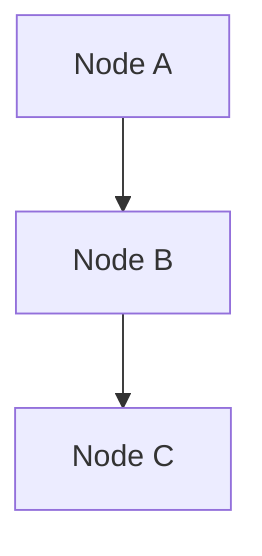
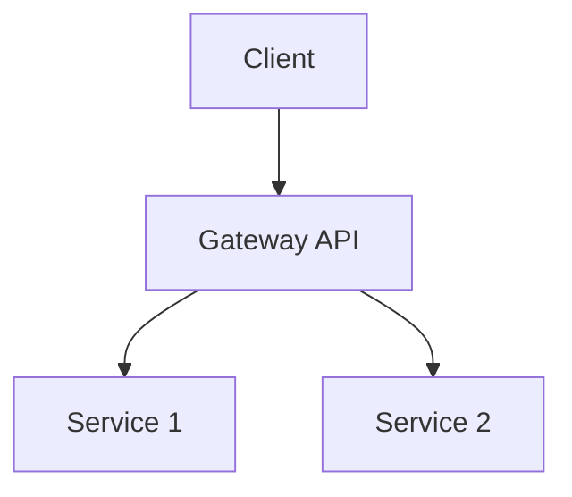
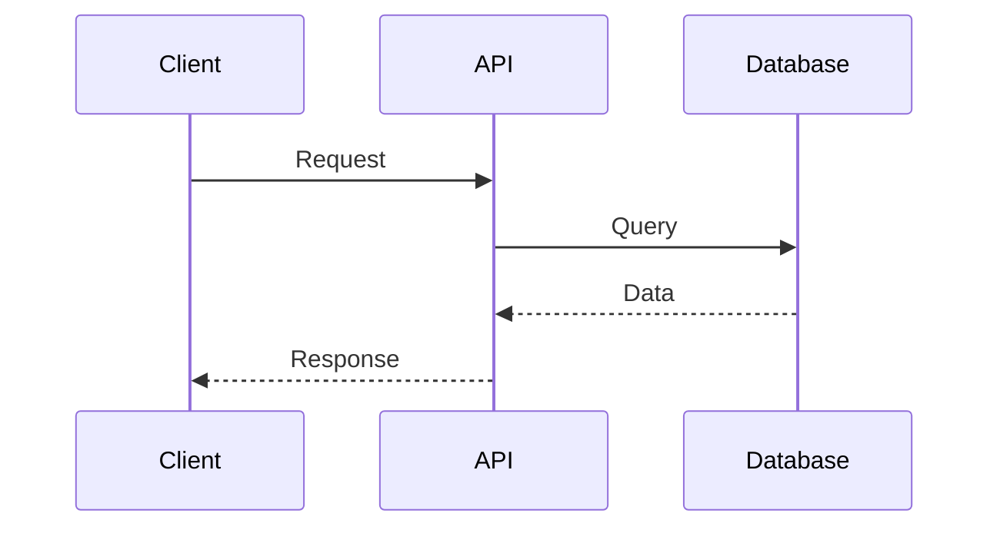

This guide provides detailed information about Mintlify components, when to use them, and best practices for each.

## Cards

### Card

Single card for highlighting important information or features.

**Usage:**
```mdx
<Card
  title="Card Title"
  icon="icon-name"
  href="/link-path"
  horizontal
>
  Card content description
</Card>
```

**Props:**
- `title` (string, required) - Card title
- `icon` (string, optional) - Lucide icon name
- `href` (string, optional) - Link destination
- `horizontal` (boolean, optional) - Horizontal layout

**When to Use:**
- Single important feature highlight
- Call-to-action card
- Navigation to key pages

**Examples:**

Standard card:
```mdx
<Card
  title="Quick Start"
  icon="rocket"
  href="/quickstart"
>
  Get started in minutes
</Card>
```

Horizontal card:
```mdx
<Card
  title="Start here"
  icon="rocket"
  href="/quickstart"
  horizontal
>
  Follow our three step quickstart guide.
</Card>
```

### CardGroup

Group of cards displayed in a grid layout.

**Usage:**
```mdx
<CardGroup cols={2}>
  <Card title="Feature 1" icon="icon1">Description</Card>
  <Card title="Feature 2" icon="icon2">Description</Card>
</CardGroup>
```

**Props:**
- `cols` (number, required) - Number of columns (typically 2 or 3)

**When to Use:**
- Feature lists (overview pages)
- Multiple related concepts
- Comparison of options

**Best Practices:**
- Use 2 columns for most feature lists
- Use 3 columns sparingly (only for many small items)
- Keep card content concise and parallel
- Use consistent icon styles

**Examples:**

Two-column feature list:
```mdx
<CardGroup cols={2}>
  <Card title="JWT Authentication" icon="key">
    Secure token-based authentication
  </Card>
  <Card title="Route Proxying" icon="route">
    Intelligent routing to services
  </Card>
  <Card title="Error Handling" icon="shield">
    Unified error response format
  </Card>
  <Card title="Service Bindings" icon="link">
    Secure inter-worker communication
  </Card>
</CardGroup>
```

## Callouts

Callouts highlight important information that needs attention.

### Note

Supplementary information that's helpful but not critical.

**Usage:**
```mdx
<Note>
  Helpful supplementary information here.
</Note>
```

**When to Use:**
- Additional context
- Technical details worth highlighting
- Information that aids understanding
- Tips that aren't critical

**Example:**
```mdx
<Note>
Admin credentials are stored in R2 bucket with SHA-256 hashed passwords.
</Note>
```

### Warning

Important cautions, breaking changes, or critical information.

**Usage:**
```mdx
<Warning>
  Important warning or caution here.
</Warning>
```

**When to Use:**
- Breaking changes
- Important cautions
- Deprecated features
- Security considerations
- Destructive actions

**Example:**
```mdx
<Warning>
This endpoint will be deprecated in v2.0. Use the new endpoint instead.
</Warning>
```

### Info

Neutral background information or context.

**Usage:**
```mdx
<Info>
  Neutral information here.
</Info>
```

**When to Use:**
- Background information
- Additional context
- Reference information
- Neutral announcements

**Example:**
```mdx
<Info>
This feature is available in all environments.
</Info>
```

### Tip

Best practices, expert advice, or optimization suggestions.

**Usage:**
```mdx
<Tip>
  Best practice or tip here.
</Tip>
```

**When to Use:**
- Best practices
- Expert advice
- Performance tips
- Optimization suggestions
- Pro tips

**Example:**
```mdx
<Tip>
Use service bindings instead of HTTP requests for better performance.
</Tip>
```

### Check

Success confirmations or completion indicators.

**Usage:**
```mdx
<Check>
  Success message here.
</Check>
```

**When to Use:**
- Confirmation messages
- Success states
- Completed steps
- Validation confirmations

**Example:**
```mdx
<Check>
Configuration validated successfully.
</Check>
```

**Callout Best Practices:**
- Keep content concise (2-3 sentences ideal)
- Don't overuse callouts (they lose impact)
- Use appropriate type for content urgency
- One callout per concept

## Code Blocks

### Standard Code Blocks

Fenced code blocks with language specification for syntax highlighting.

**Usage:**
````mdx
```typescript
const example = 'code';
```
````

**Best Practices:**
- Always specify language
- Include complete, runnable examples
- Add comments for clarity
- Use realistic data, not placeholders
- Include necessary imports/context

**Example:**
```typescript
// Import required dependencies
import { fetchData } from './api';

// Fetch data from API
const data = await fetchData('/api/endpoint');

console.log(data);
```

### CodeGroup

Multiple code examples with language tabs.

**Usage:**
````mdx
<CodeGroup>
```typescript
// TypeScript example
const example: string = 'typescript';
```

```javascript
// JavaScript example
const example = 'javascript';
```
</CodeGroup>
````

**When to Use:**
- Showing same example in multiple languages
- Comparing different approaches
- Language-specific implementations

**Best Practices:**
- Keep examples equivalent
- Order by popularity/relevance
- Limit to 2-3 languages
- Include comments explaining differences

## API Documentation Components

### ParamField

Document API request/response parameters.

**Usage:**
```mdx
<ParamField body="request">
```json
{
  "field": "value"
}
```
</ParamField>
```

**Props:**
- `body` (string, required) - "request" or "response"

**When to Use:**
- API endpoint documentation
- Request/response examples
- Parameter documentation

**Example:**
```mdx
<ParamField body="request">
```json
{
  "username": "admin",
  "password": "hashed-password"
}
```
</ParamField>

<ParamField body="response">
```json
{
  "success": true,
  "token": "jwt-token",
  "user": {
    "username": "admin",
    "role": "admin"
  }
}
```
</ParamField>
```

### ResponseField

Document API response fields with types and descriptions.

**Usage:**
```mdx
<ResponseField name="fieldName" type="string" required>
  Description of the field
</ResponseField>
```

**Props:**
- `name` (string, required) - Field name
- `type` (string, required) - Field type
- `required` (boolean, optional) - Whether field is required

**When to Use:**
- Detailed API field documentation
- Structured response documentation
- Parameter specifications

### Expandable

Collapsible content sections.

**Usage:**
```mdx
<Expandable title="Expandable Title">
  Hidden content that expands when clicked
</Expandable>
```

**When to Use:**
- Optional details
- Advanced information
- Reducing visual clutter
- Progressive disclosure

## Layout Components

### Columns

Multi-column layout for organizing content.

**Usage:**
```mdx
<Columns cols={2}>
  <Card title="Card 1">Content</Card>
  <Card title="Card 2">Content</Card>
</Columns>
```

**Props:**
- `cols` (number, required) - Number of columns

**When to Use:**
- Side-by-side content
- Comparison layouts
- Feature grids (prefer CardGroup for cards)

**Best Practices:**
- Use 2 columns for most cases
- Keep content balanced across columns
- Prefer CardGroup for card grids

### Steps

Step-by-step instructions.

**Usage:**
```mdx
<Steps>
  <Step title="Step 1">
    Description of step 1
  </Step>
  <Step title="Step 2">
    Description of step 2
  </Step>
</Steps>
```

**When to Use:**
- Installation guides
- Setup procedures
- Tutorials
- Multi-step processes

**Best Practices:**
- Keep steps focused and sequential
- Include verification steps
- Use clear, actionable titles
- Limit to 5-7 steps per procedure

## Diagram Components

### Mermaid Diagrams

Create diagrams using Mermaid syntax.

**Usage:**
````mdx

````

**Types:**
- Flowcharts (`graph`, `flowchart`)
- Sequence diagrams (`sequenceDiagram`)
- Class diagrams (`classDiagram`)
- State diagrams (`stateDiagram`)
- Gantt charts (`gantt`)

**Best Practices:**
- Keep diagrams focused and understandable
- Use clear, descriptive node labels
- Avoid overly complex diagrams
- Test diagrams render correctly
- Use camelCase/PascalCase for node IDs (no spaces)

**Examples:**

Architecture diagram:


Sequence diagram:


## Tables

Standard Markdown tables for structured data.

**Usage:**
```markdown
| Header 1 | Header 2 | Header 3 |
|----------|----------|----------|
| Value 1  | Value 2  | Value 3  |
| Value 4  | Value 5  | Value 6  |
```

**When to Use:**
- Feature comparisons
- Configuration options
- Status codes, error codes
- Parameter lists
- API endpoint summaries

**Best Practices:**
- Clear, descriptive headers
- Consistent alignment (left for text, right for numbers)
- Keep tables focused (avoid too many columns)
- Use consistent formatting across similar tables

**Example:**
```markdown
| Parameter | Type | Required | Description |
|-----------|------|----------|-------------|
| username | string | Yes | User name |
| email | string | Yes | User email address |
| age | number | No | User age (default: 0) |
```

## Component Selection Guide

### When to Use Cards

✅ **Use Cards:**
- Feature lists in overview pages
- Key concepts that need emphasis
- Quick navigation to related topics
- Visual feature highlights

❌ **Don't Use Cards:**
- For every piece of information
- In place of regular headings
- For simple lists (use markdown lists)

### When to Use Callouts

✅ **Use Callouts:**
- Important information that needs attention
- Breaking changes or warnings
- Best practices and tips
- Context that aids understanding

❌ **Don't Use Callouts:**
- For every note or comment
- For information better suited to body text
- Redundantly (if already clear from context)

### When to Use CodeGroup

✅ **Use CodeGroup:**
- Multiple language variants of same concept
- Comparing different approaches
- Language-specific implementations

❌ **Don't Use CodeGroup:**
- Single language examples (use regular code block)
- Completely different examples (use separate code blocks)

## Icon Selection

Mintlify uses Lucide icons. Select appropriate icons for cards and callouts.

**Common Icons:**
- `key` - Authentication, security, access
- `shield` - Security, protection
- `route` - Routing, navigation, paths
- `network` - Architecture, connections
- `file-text` - Documents, content, files
- `code` - Code, development, programming
- `database` - Data, storage, databases
- `settings` - Configuration, settings
- `rocket` - Getting started, launch, quick start
- `search` - Search, discovery, find
- `link` - Links, connections, references
- `alert` - Alerts, warnings, notifications
- `check` - Success, confirmation, done
- `x` - Errors, close, cancel

**Best Practices:**
- Choose icons relevant to content
- Use consistent icon styles
- Prefer simple, recognizable icons
- Icons should enhance, not distract

## Related Documentation

- [Design Guide](/design/guide) - Comprehensive writing guidelines
- [Design System](/design/system) - Design system principles
- [Page Templates](/design/templates) - Page structure templates
- [Review Checklist](/design/review-checklist) - Quality checklist

