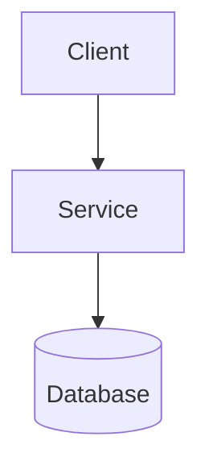
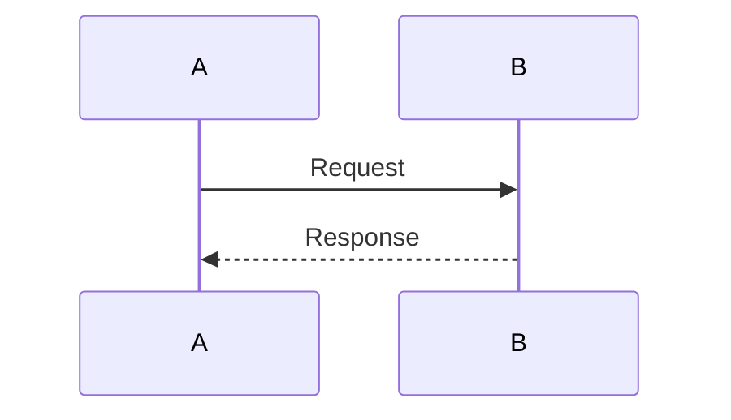

This guide provides practical guidelines for writing documentation that aligns with Paper UI principles and maintains consistency across the MetaCogna Suite documentation.

## Quick Reference

### Component Cheat Sheet

| Component | Usage | Example |
|-----------|-------|---------|
| `<Card>` | Single feature highlight | `<Card title="Feature" icon="key">Description</Card>` |
| `<CardGroup cols={2}>` | Multiple features (2-col) | `<CardGroup cols={2}>...</CardGroup>` |
| `<Note>` | Helpful information | `<Note>Supplementary info</Note>` |
| `<Warning>` | Important caution | `<Warning>Breaking change</Warning>` |
| `<Info>` | Neutral context | `<Info>Background info</Info>` |
| `<Tip>` | Best practice | `<Tip>Pro tip</Tip>` |
| `<CodeGroup>` | Multiple languages | `<CodeGroup>...</CodeGroup>` |
| `` ```language `` | Code block | `` ```typescript ` `` |

## Page Structure

### Standard Page Layout

Every page should follow this structure:

1. **Frontmatter** (required)
2. **Introduction** (1-2 paragraphs)
3. **Main Content** (sections with H2 headings)
4. **Related Documentation** (links to related pages)

### Frontmatter Template

```yaml
---
title: "Page Title"
description: "Brief description (50-150 chars)"
---
```

**Guidelines:**
- Title: Clear, specific, keyword-rich
- Description: Concise summary for SEO and preview cards
- No trailing periods in description

## Page Templates

### Overview Page Template

```mdx
---
title: "Project Overview"
description: "Brief description"
---

[1-2 paragraph introduction]

## Architecture

[Mermaid diagram or description]

## Key Features

<CardGroup cols={2}>
  <Card title="Feature 1" icon="icon-name">
    Description
  </Card>
  <!-- More cards -->
</CardGroup>

## Technology Stack

### Backend
- Technology 1
- Technology 2

### Frontend
- Technology 1
- Technology 2

## Quick Start

### Prerequisites
- Requirement 1
- Requirement 2

### Installation

```bash
command here
```

### Development

```bash
command here
```

## Project Structure

```
project/
├── folder/
│   └── file.ext
```

## Related Documentation

- [API Reference](/path) - API details
- [Frontend Guide](/path) - Frontend docs
```

### API Documentation Template

```mdx
---
title: "API Endpoint"
description: "Endpoint description"
---

## Base URL

- **Local**: `http://localhost:port`
- **Production**: `https://production.url`

## Endpoint

### METHOD /path

[Brief description]

<Note>
Important note about endpoint
</Note>

<ParamField body="request">
```json
{
  "field": "value"
}
```
</ParamField>

<ParamField body="response">
```json
{
  "field": "value"
}
```
</ParamField>

#### Request Parameters

**field (required)**
Description of parameter.

**field2 (optional)**
Description with default value.

#### Response

[Description of response]

#### Error Responses

| Code | Description |
|------|-------------|
| 400 | Bad request |
| 401 | Unauthorized |

## Example Request

```typescript
const response = await fetch('/api/endpoint', {
  method: 'POST',
  body: JSON.stringify({ field: 'value' })
});
```

## Related Documentation

- [Other Endpoint](/path) - Related endpoint
```

### Component Documentation Template

```mdx
---
title: "Component Name"
description: "Component description"
---

[Brief introduction]

## Usage

```typescript
<ComponentName prop="value">
  Content
</ComponentName>
```

## Props

| Prop | Type | Required | Description |
|------|------|----------|-------------|
| prop1 | string | Yes | Description |
| prop2 | number | No | Description with default |

## Examples

### Basic Usage

```typescript
<ComponentName prop="value" />
```

### Advanced Usage

```typescript
<ComponentName prop="value">
  <ChildComponent />
</ComponentName>
```

## Related Documentation

- [Other Component](/path) - Related component
```

## Component Usage Guidelines

### Cards

**When to Use:**
- Feature lists in overview pages
- Key concepts that need emphasis
- Quick navigation to related topics

**When NOT to Use:**
- For every piece of information
- In place of regular headings
- For simple lists (use markdown lists instead)

**Icon Selection:**
- Choose relevant icons from Lucide icon set
- Icons should match content theme
- Use consistent icon styles (e.g., all use solid or all use outlined)

**CardGroup Columns:**
- **2 columns**: Most common, good for feature lists
- **3 columns**: Use sparingly, only for many small items
- **4+ columns**: Generally avoid, becomes too cramped

### Callouts

**`<Note>`**
- Helpful supplementary information
- Technical details worth highlighting
- Context that aids understanding

**`<Warning>`**
- Breaking changes
- Important cautions
- Deprecated features
- Security considerations

**`<Info>`**
- Neutral background information
- Additional context
- Reference information

**`<Tip>`**
- Best practices
- Expert advice
- Performance tips
- Optimization suggestions

**Guidelines:**
- Keep callout content concise (2-3 sentences ideal)
- Don't overuse callouts (they lose impact)
- Use appropriate type for content urgency

### Code Blocks

**Language Tags:**
Always specify language for syntax highlighting:
- `typescript`, `javascript`, `json`, `bash`, `yaml`, `markdown`, etc.

**Complete Examples:**
Include complete, runnable examples:
- Include necessary imports
- Include setup/context
- Use realistic data

**Comments:**
Add comments to explain non-obvious parts:
```typescript
// This function processes the request
function processRequest(data: RequestData) {
  // Validate input
  if (!data.valid) throw new Error('Invalid');
  
  return transform(data);
}
```

**CodeGroup:**
Use when showing multiple language variants:
````mdx
<CodeGroup>
```typescript
// TypeScript version
```

```javascript
// JavaScript version
```
</CodeGroup>
````

### Tables

**When to Use:**
- Feature comparisons
- Configuration options
- Status codes, error codes
- Parameter lists
- API endpoint summaries

**Formatting:**
- Clear, descriptive headers
- Consistent alignment
- Proper markdown syntax
- Keep tables focused (avoid too many columns)

**Example:**
```markdown
| Parameter | Type | Required | Description |
|-----------|------|----------|-------------|
| name | string | Yes | User name |
| email | string | Yes | User email |
```

### Mermaid Diagrams

**When to Use:**
- System architecture
- Process flows
- Sequence diagrams
- Entity relationships

**Guidelines:**
- Keep diagrams focused (avoid overly complex)
- Use clear, descriptive node labels
- Follow Mermaid syntax best practices
- Test diagrams render correctly

**Common Patterns:**

Architecture:


Sequence:


## Writing Guidelines

### Voice & Tone

- **Second Person**: Use "you" for instructions ("You can install...")
- **Active Voice**: Prefer active over passive
- **Present Tense**: Write in present tense
- **Clear & Concise**: Avoid unnecessary words

### Headings

- **Descriptive**: Headings should clearly describe content
- **Keyword-Rich**: Include relevant keywords
- **Consistent**: Similar pages use similar heading patterns
- **Hierarchical**: Maintain proper H2 → H3 hierarchy

### Lists

- **Bulleted**: For unordered items, features, characteristics
- **Numbered**: For sequential steps, procedures
- **Parallel Structure**: Items in lists should be parallel
- **Concise**: Keep list items brief

### Links

- **Descriptive Text**: "Read the API guide" not "click here"
- **Relative Paths**: Use `/page-name` format
- **Valid Links**: Ensure all links point to existing pages
- **Context**: Links should make sense in context

## Common Patterns

### Feature List Pattern

```mdx
## Key Features

<CardGroup cols={2}>
  <Card title="Feature Name" icon="icon-name">
    Brief description of the feature and its benefits.
  </Card>
  <!-- Repeat for each feature -->
</CardGroup>
```

### Quick Start Pattern

```mdx
## Quick Start

### Prerequisites

- Requirement 1
- Requirement 2

### Installation

```bash
command to install
```

### Basic Usage

```typescript
// Minimal example
```

<Note>
Important note about setup
</Note>
```

### API Endpoint Pattern

```mdx
### METHOD /path

[Brief description]

<ParamField body="request">
```json
{
  "field": "value"
}
```
</ParamField>

<ParamField body="response">
```json
{
  "result": "data"
}
```
</ParamField>
```

### Error Handling Pattern

```mdx
## Error Responses

All errors follow this format:

```json
{
  "error": "Error message",
  "code": "ERROR_CODE"
}
```

| Code | Status | Description |
|------|--------|-------------|
| ERROR_CODE | 400 | Description |
```

## Best Practices

### Do's

✅ **Do** use CardGroup for feature lists  
✅ **Do** include code examples with language tags  
✅ **Do** use descriptive headings and link text  
✅ **Do** include "Related Documentation" sections  
✅ **Do** use callouts for important information  
✅ **Do** include complete, runnable code examples  
✅ **Do** use Mermaid diagrams for complex concepts  
✅ **Do** keep paragraphs concise (3-5 sentences)  
✅ **Do** use lists for multiple items  
✅ **Do** make technical details visible  

### Don'ts

❌ **Don't** use cards for every piece of information  
❌ **Don't** overuse callouts  
❌ **Don't** use placeholder data in examples  
❌ **Don't** hide technical details  
❌ **Don't** create overly complex diagrams  
❌ **Don't** use "click here" for link text  
❌ **Don't** write walls of text  
❌ **Don't** forget language tags on code blocks  
❌ **Don't** use vague headings  
❌ **Don't** forget related documentation links  

## Accessibility

### Semantic HTML

Mintlify handles most semantic HTML, but ensure:
- Proper heading hierarchy (H2 → H3)
- Lists use proper markdown syntax
- Links have descriptive text

### Alt Text

If using images:
- Provide descriptive alt text
- Alt text should describe image content/purpose
- Keep alt text concise but informative

### Color Contrast

- Mintlify theme handles contrast automatically
- Code blocks readable in both light/dark modes
- Ensure diagrams have sufficient contrast

## Related Documentation

- [Design System](/design/system) - Paper UI principles
- [Review Checklist](/design/review-checklist) - Quality checklist
- [Page Templates](/design/templates) - Detailed templates
- [Component Guide](/design/components) - Component details

