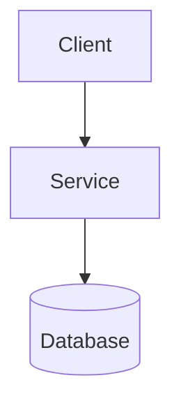
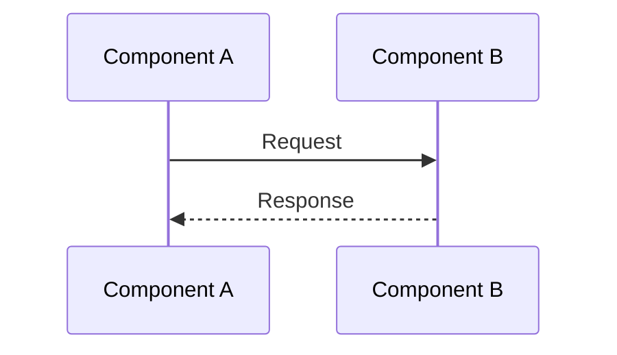

This document outlines the Paper UI design system as applied to Mintlify documentation. It provides guidelines for maintaining visual consistency and aligning documentation with the Paper UI design philosophy.

## Design Philosophy

The Paper UI design system is built on three core principles:

1. **Digital Paper** - Elements are physical sheets of paper layered on a surface
2. **Hard Edges** - Clear boundaries, minimal rounded corners (max 2px)
3. **High Contrast** - Strict polarity between Ink (dark) and Paper (light)

### Applying to Documentation

While Mintlify provides its own styling, we apply Paper UI principles through:
- **Clear Structure**: Explicit section boundaries and hierarchy
- **Visible Construction**: Technical details visible, not hidden
- **High Contrast**: Clear visual hierarchy through typography and spacing
- **Hard Edges**: Clear separation between sections and concepts

## Color System

### Paper UI Colors

The Paper UI system uses semantic color naming:

| Token | Hex | Usage |
|-------|-----|-------|
| **Ink** | `#18181b` (Zinc 950) | Primary text, borders, hard shadows |
| **Paper** | `#ffffff` (White) | Cards, modals, primary backgrounds |
| **Surface** | `#f4f4f5` (Zinc 100) | Background/desk surface |
| **Accent** | `#10b981` (Emerald 500) | Success states, highlights |
| **Warning** | `#ef4444` (Red 500) | Errors, delete actions, critical alerts |

### Mintlify Color Mapping

In `docs.json`, colors are configured to align with Paper UI:

```json
{
  "colors": {
    "primary": "#10b981",    // Paper UI Accent (Emerald 500)
    "light": "#07C983",      // Lighter accent for dark mode
    "dark": "#15803D"        // Darker accent for buttons
  }
}
```

**Mapping:**
- `primary` → Paper UI Accent (Emerald 500) - Used for highlights, links, active states
- `light` → Lighter green for dark mode accents
- `dark` → Darker green for primary buttons

### Dark Mode

In dark mode, the polarity flips:
- **Ink** (dark text) becomes light (`#f4f4f5`)
- **Paper** (light background) becomes dark (`#18181b`)
- **Accent** remains consistent (green)

Mintlify handles dark mode automatically based on user preference.

## Typography

Paper UI uses three distinct typefaces to separate **Narrative**, **Utility**, and **Data**.

### 1. The Voice of Authority (Serif)

- **Font**: `Playfair Display`
- **Usage in Docs**: H1 titles (via frontmatter), major section headings conceptually
- **Style**: Bold, tight tracking, classic editorial feel
- **Mintlify Equivalent**: H1 headings (styled by Mintlify theme)

### 2. The Voice of Utility (Sans-Serif)

- **Font**: `Inter`
- **Usage in Docs**: Body text, descriptions, most content
- **Style**: Standard weights, generous line-height, highly legible
- **Mintlify Equivalent**: Default body text (Mintlify uses system sans-serif)

### 3. The Voice of the Machine (Monospace)

- **Font**: `JetBrains Mono`
- **Usage in Docs**: Code blocks, inline code, technical terms, file paths
- **Style**: Uppercase often, smaller size, wide tracking
- **Mintlify Equivalent**: Code blocks (Mintlify uses monospace font for code)

### Typography Guidelines

**Headings:**
- Use H2 for main sections
- Use H3 for subsections
- Keep headings descriptive and keyword-rich
- Maintain consistent heading patterns across similar pages

**Body Text:**
- Keep paragraphs concise (3-5 sentences)
- Use lists for multiple items
- Use inline code (backticks) for technical terms, filenames, commands
- Use bold sparingly for emphasis

**Code:**
- Use inline code for short snippets, variable names, commands
- Use code blocks for multi-line examples
- Always specify language tags
- Include comments in code examples when helpful

## Component Mapping

### Paper UI → Mintlify Components

| Paper UI Component | Mintlify Component | Usage |
|--------------------|-------------------|-------|
| **PaperCard** | `<Card>` | Feature highlights, key concepts |
| **PaperCard Group** | `<CardGroup>` | Multiple related features (2-column typical) |
| **PaperButton** | (Not directly mapped) | Links in cards serve as buttons |
| **Callout/Alert** | `<Note>`, `<Warning>`, `<Info>`, `<Tip>` | Important information, cautions |
| **Code Block** | ` ```language ` | Code examples, technical snippets |
| **Badge** | (Not directly mapped) | Status indicators in text |

### Card Usage

**CardGroup (2-column):**
Use for feature lists, especially in overview pages:

```mdx
<CardGroup cols={2}>
  <Card title="Feature 1" icon="key">
    Description
  </Card>
  <Card title="Feature 2" icon="shield">
    Description
  </Card>
</CardGroup>
```

**Individual Card:**
Use for single important highlights:

```mdx
<Card title="Important" icon="alert">
  Key information here
</Card>
```

### Callout Boxes

Map to Paper UI's "visible construction" principle:

- **`<Note>`**: Helpful supplementary information (visible technical details)
- **`<Warning>`**: Important cautions, breaking changes (high contrast alerts)
- **`<Info>`**: Neutral contextual information
- **`<Tip>`**: Best practices, expert advice

**Guidelines:**
- Use callouts for information that should stand out
- Keep callout content concise
- Use appropriate callout type for content urgency

## Spacing & Layout

### Section Spacing

- **Between Major Sections (H2)**: Generous spacing (equivalent to `p-8` conceptually)
- **Between Subsections (H3)**: Moderate spacing
- **Within Sections**: Standard paragraph spacing
- **Around Code Blocks**: Extra spacing for readability

### Content Organization

Follow Paper UI's aggressive use of whitespace:

1. **Narrative Sections**: Overview, introduction, concepts
2. **Technical Sections**: Code examples, API details, implementation
3. **Clear Separation**: Visual separation between narrative and technical content

### Lists

- **Bulleted Lists**: For unordered items, features, characteristics
- **Numbered Lists**: For sequential steps, procedures
- **Nested Lists**: Use sparingly, maintain clear hierarchy

## Iconography

### Icon Selection

- **Source**: Use Lucide icon names (Mintlify supports these)
- **Style**: Sharp, clean lines matching Paper UI aesthetic
- **Usage**: Icons in cards should be relevant to content
- **Pairing**: Icons paired with descriptive text (not standalone)

### Common Icons

- `key` - Authentication, security
- `shield` - Security, protection
- `route` - Routing, navigation
- `network` - Architecture, connections
- `file-text` - Documents, content
- `code` - Code, development
- `database` - Data, storage
- `settings` - Configuration
- `rocket` - Getting started, launch
- `search` - Search, discovery

## Mermaid Diagrams

### Styling Guidelines

Follow Paper UI's "hard edges" principle:

- **Node Names**: No spaces, use camelCase or PascalCase
- **Labels**: Clear, descriptive (use quotes for special characters)
- **Colors**: Avoid explicit colors (let theme handle it)
- **Complexity**: Keep diagrams focused and understandable
- **Purpose**: Use diagrams to clarify concepts that text cannot

### Common Patterns

**Architecture Diagrams:**


**Sequence Diagrams:**


## Tables

### Formatting Guidelines

- **Headers**: Clear, descriptive column headers
- **Alignment**: Left for text, right for numbers
- **Consistency**: Similar tables use similar formatting
- **Width**: Keep tables readable (avoid overly wide tables)

### When to Use Tables

- **Comparisons**: Feature comparisons, API endpoint lists
- **Configuration**: Settings, options, parameters
- **Reference Data**: Status codes, error codes, mappings

## Code Examples

### Formatting

- **Language Tags**: Always specify language
- **Completeness**: Include complete, runnable examples
- **Context**: Include necessary imports, setup
- **Comments**: Add comments for clarity
- **Real Data**: Use realistic data, not placeholders

### CodeGroup Usage

Use `<CodeGroup>` when showing multiple language variants:

````mdx
<CodeGroup>
```typescript
// TypeScript example
```

```javascript
// JavaScript example
```
</CodeGroup>
````

## Visible Construction

Paper UI's "visible construction" principle means showing technical details:

- **File Paths**: Show actual file paths in examples
- **Configuration**: Show actual configuration values
- **IDs/Keys**: Show example IDs, not just "ID: xxx"
- **Status Values**: Show actual status strings, error codes
- **Metadata**: Make technical metadata visible in examples

## Best Practices

### Do's

- ✅ Use CardGroup for feature lists (2-column typical)
- ✅ Use appropriate callout types for important information
- ✅ Include code examples with language tags
- ✅ Use descriptive headings and link text
- ✅ Include "Related Documentation" sections
- ✅ Use Mermaid diagrams for complex concepts
- ✅ Make technical details visible and explicit

### Don'ts

- ❌ Don't use cards for every piece of information
- ❌ Don't overuse callouts (they lose impact)
- ❌ Don't use placeholder data in examples
- ❌ Don't hide technical details (visible construction)
- ❌ Don't create overly complex diagrams
- ❌ Don't use "click here" for link text

## Related Documentation

- [Design Guide](/design/guide) - Practical Mintlify guidelines
- [Review Checklist](/design/review-checklist) - Quality checklist
- [Page Templates](/design/templates) - Standard page structures
- [Component Guide](/design/components) - Detailed component usage

