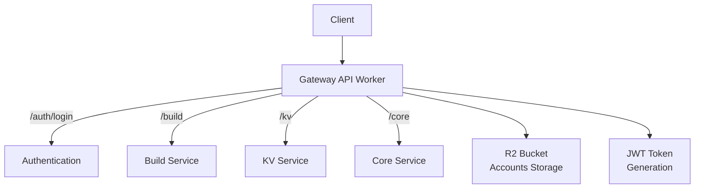

The Gateway API is a Cloudflare Worker that serves as the single entry point for all MetaCogna services. It handles authentication, routing, and request proxying to downstream workers.

## Architecture

The Gateway API acts as a reverse proxy with JWT-based authentication, routing requests to specialized workers:



## Key Features

<CardGroup cols={2}>
  <Card title="JWT Authentication" icon="key">
    Secure token-based authentication with SHA-256 credential hashing
  </Card>
  <Card title="Route Proxying" icon="route">
    Intelligent routing to BUILD, KV, and CORE services
  </Card>
  <Card title="Error Handling" icon="shield">
    Unified error response format across all routes
  </Card>
  <Card title="Service Bindings" icon="link">
    Secure inter-worker communication via Cloudflare service bindings
  </Card>
</CardGroup>

## Routing Matrix

The gateway routes requests based on URL prefixes:

| Prefix | Route Type | Target Service | Authentication |
|--------|-----------|----------------|----------------|
| `/auth/login` | Authentication | Internal | None (public) |
| `/auth/guest` | Guest Token | Internal | None (public) |
| `/build` | Build Service | BUILD_SERVICE_URL | Required (JWT) |
| `/kv` | KV Service | KV_SERVICE_URL | Optional (if Bearer token provided) |
| `/core` | Core Service | CORE_SERVICE_URL | Optional (if Bearer token provided) |

## Quick Start

### Installation

```bash
cd gateway-api
bun install
```

### Development

```bash
# Run all packages in development mode
bun run dev
```

### Environment Setup

The gateway requires the following environment variables:

- `GATEWAY_JWT_SECRET` - Secret key for JWT signing and verification
- `BUILD_SERVICE_URL` - URL of the build service worker
- `KV_SERVICE_URL` - URL of the KV service worker
- `CORE_SERVICE_URL` - URL of the core service worker

### R2 Bucket

The gateway uses an R2 bucket (`metacogna-accounts`) to store admin credentials:

- Path format: `auth/admins/{username}.json`
- Structure: `{ username, salt, hash, role }`

## Project Structure

```
gateway-api/
├── packages/
│   ├── gateway-worker/     # Main gateway worker
│   │   ├── src/index.ts    # Request handler
│   │   └── wrangler.toml   # Cloudflare configuration
│   └── shared/              # Shared utilities
│       └── src/
│           └── gateway.ts   # JWT utilities, schemas
├── docs/
│   └── routing-matrix.md    # Detailed routing documentation
└── scripts/
    └── deploy-gateway.sh    # Deployment script
```

## How It Works

1. **Client Request**: Client sends request to `api.metacogna.ai/{path}`
2. **Authentication**: For protected routes, client includes `Authorization: Bearer {token}` header
3. **Route Matching**: Gateway matches URL prefix to route configuration
4. **Token Verification**: For protected routes, gateway verifies JWT token
5. **URL Rewriting**: Gateway strips route prefix and forwards to target service
6. **Response Proxying**: Gateway returns response from downstream service

## Related Documentation

- [Authentication API](/gateway-api/api/authentication) - Login and token generation
- [Routing API](/gateway-api/api/routing) - Route configuration and proxying
- [Gateway Worker](/gateway-api/backend/worker) - Worker implementation details
- [Shared Package](/gateway-api/backend/shared-package) - JWT utilities and schemas

