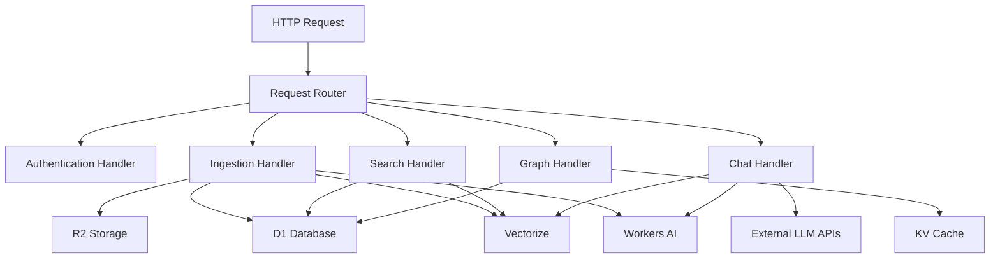

The MetaCogna RAG worker is a Cloudflare Worker that handles all backend functionality including authentication, document ingestion, vector search, and knowledge graph extraction.

## Architecture



## Environment Bindings

```typescript
interface Env {
  AI: any;                    // Workers AI binding
  VECTORIZE: VectorizeIndex;  // Vectorize index (768 dimensions)
  DB: D1Database;             // D1 SQLite database
  KV: KVNamespace;            // KV for caching and rate limiting
  metacogna_vault: R2Bucket;  // R2 bucket for document storage
  
  // Optional API Keys (secrets)
  GEMINI_API_KEY?: string;
  OPENAI_API_KEY?: string;
  ANTHROPIC_API_KEY?: string;
  
  // Optional Observability
  LANGFUSE_PUBLIC_KEY?: string;
  LANGFUSE_SECRET_KEY?: string;
  LANGFUSE_HOST?: string;
  API_BASE_URL?: string;
}
```

## Request Routing

The worker uses a simple path-based router:

```typescript
export default {
  async fetch(request: Request, env: Env): Promise<Response> {
    const url = new URL(request.url);
    const path = url.pathname;
    const method = request.method;
    
    // Route handlers
    if (path === '/api/auth/login') { /* ... */ }
    if (path === '/api/signup') { /* ... */ }
    if (path === '/api/ingest') { /* ... */ }
    if (path === '/api/search') { /* ... */ }
    if (path === '/api/chat') { /* ... */ }
    if (path === '/api/graph') { /* ... */ }
  }
};
```

## Core Functions

### Semantic Chunking

Text is split into semantic chunks for embedding:

```typescript
function semanticChunk(
  text: string, 
  maxSize: number = 512, 
  overlap: number = 50
): string[] {
  // Split on sentence boundaries
  // Maintain overlap between chunks
  // Return array of chunks
}
```

**Parameters:**
- `maxSize`: Maximum chunk size in characters (default: 512)
- `overlap`: Overlap size in characters (default: 50)

### Rate Limiting

KV-based rate limiting per user and endpoint:

```typescript
async function checkRateLimit(
  kv: KVNamespace,
  userId: string,
  endpoint: string,
  maxRequests: number = 10,
  windowSeconds: number = 60
): Promise<{
  allowed: boolean;
  remaining: number;
  resetAt: number;
}>
```

**Rate Limits:**
- Chat: 10 requests per minute
- Search: 20 requests per minute

## Ingestion Pipeline

The ingestion process runs through 4 stages:

### 1. Chunking (0-29%)

- Text split into semantic chunks (~500 chars)
- Sentence boundary preservation
- Overlap between chunks for context

### 2. Embedding (30-59%)

- Generate 768-dimensional embeddings using Workers AI
- Model: `@cf/baai/bge-base-en-v1.5`
- Store in Vectorize index

### 3. Graph Extraction (60-89%)

- Extract entities and relationships using LLM
- Model: `@cf/meta/llama-3-8b-instruct`
- Store nodes and edges in D1 database

### 4. Finalizing (90-100%)

- Update document status
- Store metadata
- Mark ingestion complete

## Database Schema

### Tables

**users**
- User authentication and profile data
- Fields: `id`, `username`, `email`, `passwordHash`, `goals`, `isAdmin`

**documents**
- Document metadata
- Fields: `id`, `userId`, `title`, `content` (preview), `r2Key`, `metadata`, `status`

**graph_nodes**
- Knowledge graph entities
- Fields: `id`, `label`, `type`, `summary`, `documentId`

**graph_edges**
- Knowledge graph relationships
- Fields: `id`, `source`, `target`, `relation`, `documentId`

See [Database Schema](/metacogna-rag/backend/services#database-schema) for complete schema.

## Storage Strategy

### R2 Storage

Full document content is stored in R2:
- **Path format**: `users/{userId}/documents/{docId}-{filename}`
- **Metadata**: Stored as R2 object metadata
- **Content types**: PDF, Markdown, Text

### D1 Database

Metadata and previews stored in D1:
- **Preview**: First 500 characters of document
- **Metadata**: JSON string with custom metadata
- **Status**: Processing state tracking

### Vectorize

Vector embeddings stored in Vectorize:
- **Dimensions**: 768
- **Metric**: Cosine similarity
- **Metadata**: Document ID, title, chunk index

## Error Handling

All endpoints use consistent error responses:

```typescript
const errorResponse = (msg: string, status = 500) => 
  jsonResponse({ error: msg, success: false }, status);
```

## CORS

CORS headers for all responses:

```typescript
headers: {
  'Access-Control-Allow-Origin': '*',
  'Access-Control-Allow-Methods': 'GET, POST, OPTIONS',
  'Access-Control-Allow-Headers': 'Content-Type, Authorization',
}
```

## Configuration

### wrangler.toml

```toml
name = "metacogna"
main = "src/index.ts"
compatibility_date = "2024-01-01"
compatibility_flags = ["nodejs_compat"]

routes = [
  { pattern = "parti.metacogna.ai/*", zone_name = "metacogna.ai" }
]

[ai]
binding = "AI"

[[vectorize]]
binding = "VECTORIZE"
index_name = "metacogna-index"

[[d1_databases]]
binding = "DB"
database_name = "metacogna-db"

[[r2_buckets]]
binding = "metacogna_vault"
bucket_name = "metacogna-vault"

[[kv_namespaces]]
binding = "KV"
id = "kv-namespace-id"
```

## Deployment

```bash
cd metacogna-rag/worker
bun wrangler deploy
```

Or use the deployment script:

```bash
cd metacogna-rag
bun run deploy:full
```

## Related Documentation

- [Backend Services](/metacogna-rag/backend/services) - Service layer details
- [API Endpoints](/metacogna-rag/api/endpoints) - Complete API reference
- [Chat Endpoint](/metacogna-rag/api/chat-endpoint) - Chat implementation

