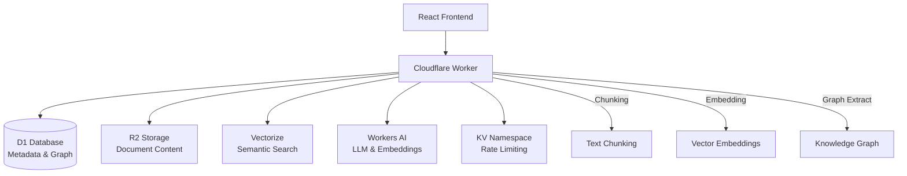

MetaCogna RAG is a production-ready RAG system built on Cloudflare Workers that combines document storage, vector search, and knowledge graph extraction to provide intelligent question-answering capabilities.

## Architecture



## Key Features

<CardGroup cols={2}>
  <Card title="Document Management" icon="file-text">
    Upload and index .md, .pdf, .txt files with metadata tracking
  </Card>
  <Card title="Vector Search" icon="search">
    Semantic search with 768-dimensional embeddings using Vectorize
  </Card>
  <Card title="Knowledge Graph" icon="network">
    Entity and relationship extraction for graph visualization
  </Card>
  <Card title="RAG Chat" icon="message-circle">
    Context-aware chat with multiple LLM providers
  </Card>
  <Card title="Prompt Engineering" icon="sparkles">
    Template library with variable interpolation
  </Card>
  <Card title="Admin User Management" icon="users">
    Controlled user creation with goal-driven personalization
  </Card>
</CardGroup>

## Technology Stack

### Backend

- **Cloudflare Workers** - Edge compute runtime
- **D1** - SQLite database for metadata and graph nodes
- **R2** - Object storage for document content
- **Vectorize** - Vector database (768 dimensions, cosine similarity)
- **Workers AI** - LLM and embedding generation

### Frontend

- **React 18** - UI framework
- **Vite** - Build tool and dev server
- **Tailwind CSS** - Styling with Paper UI theme
- **Zustand** - State management
- **Framer Motion** - Animations

## Quick Start

### Prerequisites

- **Bun** (recommended) or Node.js 18+
- **Cloudflare Account** with Workers access
- **Wrangler CLI** (installed via Bun)

### Installation

```bash
cd metacogna-rag
bun install
```

### Environment Setup

Create `.env.local`:

```bash
# Required for Prompt Lab
VITE_GEMINI_API_KEY=your-gemini-key

# Optional: Other API keys as needed
```

### Development

```bash
# Start frontend dev server
bun run dev

# Run worker locally
bun run worker:dev

# Run tests
bun run test:e2e
```

### Deployment

```bash
# Set up infrastructure (DB + Vector)
bun run deploy:setup

# Deploy Worker + Frontend
bun run deploy:full
```

## Project Structure

```
metacogna-rag/
├── components/          # React components
│   ├── PaperComponents.tsx
│   ├── Layout.tsx
│   └── ErrorBoundary.tsx
├── views/              # Main views
│   ├── UploadView.tsx
│   ├── QuestionView.tsx
│   ├── KnowledgeGraphView.tsx
│   └── PromptGenView.tsx
├── services/           # Frontend services
│   ├── ApiClient.ts
│   ├── AuthService.ts
│   ├── RAGEngine.ts
│   └── LLMService.ts
├── worker/             # Cloudflare Worker backend
│   ├── src/
│   │   ├── index.ts    # Main handler
│   │   ├── handlers/   # Route handlers
│   │   └── services/   # R2, summarization
│   └── __tests__/      # Worker tests
├── db/                 # Database schema
│   └── schema.sql
├── e2e/                # Playwright E2E tests
└── deployment/         # Deployment docs
```

## Core Concepts

### RAG Pipeline

The ingestion pipeline processes documents through 4 stages:

1. **Chunking (0-29%)** - Text splitting into semantic chunks (~500 chars)
2. **Embedding (30-59%)** - Vector embedding generation (768 dimensions)
3. **Graph Extraction (60-89%)** - Entity and relationship extraction
4. **Finalizing (90-100%)** - Final indexing and metadata updates

### Knowledge Graph

The system extracts entities and relationships from documents:

- **Nodes**: Entities (people, concepts, topics)
- **Edges**: Relationships between entities
- **Metadata**: Node types, connection strengths, document sources

### Authentication

- **Admin-only signup**: Only administrators can create users
- **SHA-256 hashing**: Secure password storage
- **Session cookies**: 7-day expiry, HttpOnly, secure
- **Worker-based auth**: No localStorage credentials

## Related Documentation

- [API Endpoints](/metacogna-rag/api/endpoints) - Complete API reference
- [Chat Endpoint](/metacogna-rag/api/chat-endpoint) - RAG chat functionality
- [Frontend Views](/metacogna-rag/frontend/views) - React views and components
- [Backend Worker](/metacogna-rag/backend/worker) - Worker architecture
- [Design System](/metacogna-rag/design/system) - Paper UI components

