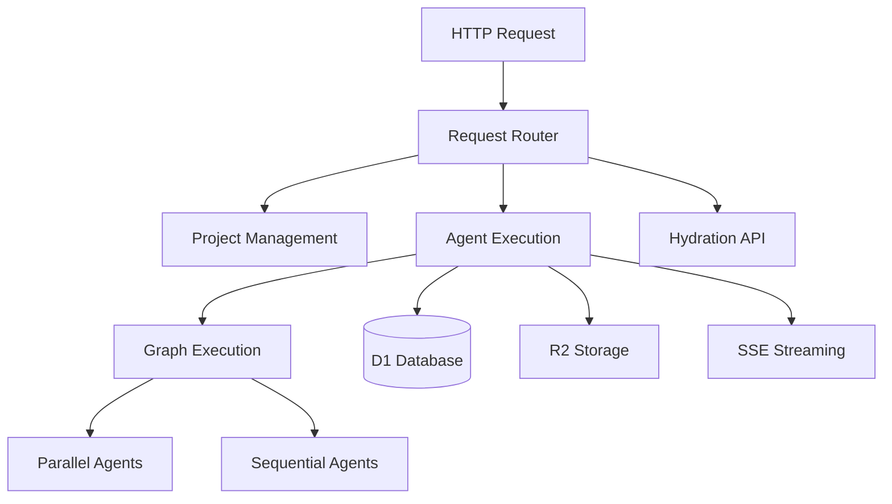

The Supervisor worker orchestrates agent execution, manages project state, and handles human-in-the-loop interrupts.

## Architecture



## Environment Bindings

```typescript
interface Env {
  PRD_AGENT: Fetcher;
  DATA_AGENT: Fetcher;
  DESIGN_AGENT: Fetcher;
  LOGIC_AGENT: Fetcher;
  API_AGENT: Fetcher;
  FRONTEND_AGENT: Fetcher;
  DEPLOYMENT_AGENT: Fetcher;
  DB: D1Database;
  STORAGE: R2Bucket;
}
```

## Key Functions

### Project Management

**List Projects**
```typescript
GET /api/projects
// Returns all projects ordered by updated_at
```

**Create Project**
```typescript
POST /api/projects
// Creates new project with product seed
```

**Hydrate Project**
```typescript
GET /api/hydrate/:projectId
// Returns complete project state with history
```

### Agent Execution

**executeParallelNodes**

Executes agents in parallel (fan-out/fan-in):

```typescript
async function executeParallelNodes(
  state: ArchitectureState,
  env: Env
): Promise<ArchitectureState> {
  // 1. Map agents for parallel execution
  // 2. Execute in parallel (Promise.all)
  // 3. Merge results (fan-in)
  // 4. Return updated state
}
```

**executeSequentialNodes**

Executes agents sequentially:

```typescript
async function executeSequentialNodes(
  state: ArchitectureState,
  env: Env
): Promise<ArchitectureState> {
  // Execute agents one by one
  // Wait for each to complete
  // Pass context to next agent
}
```

### Streaming

**handleStreamRequest**

Handles Server-Sent Events for real-time updates:

```typescript
async function handleStreamRequest(
  request: Request,
  env: Env
): Promise<Response> {
  // Create TransformStream for SSE
  // Stream agent progress events
  // Stream completion events
}
```

### Context Assembly

**assembleContext**

Assembles context from previous artifacts:

```typescript
async function assembleContext(
  env: Env,
  projectId: string
): Promise<string> {
  // Fetch previous artifacts
  // Combine into context string
  // Return formatted context
}
```

## Database Schema

### projects Table

```sql
CREATE TABLE projects (
  id TEXT PRIMARY KEY,
  name TEXT NOT NULL,
  product_seed TEXT,
  current_phase TEXT,
  status TEXT,
  created_at INTEGER,
  updated_at INTEGER
);
```

### artifacts Table

```sql
CREATE TABLE artifacts (
  id TEXT PRIMARY KEY,
  project_id TEXT,
  phase TEXT,
  type TEXT,
  content TEXT,
  created_at INTEGER
);
```

### execution_traces Table

```sql
CREATE TABLE execution_traces (
  id TEXT PRIMARY KEY,
  project_id TEXT,
  phase TEXT,
  agent TEXT,
  status TEXT,
  created_at INTEGER
);
```

## Storage Strategy

- **D1 Database**: Projects, artifacts, execution traces
- **R2 Storage**: Large artifacts (if content > threshold)
- **Artifact Keys**: `artifacts/{projectId}/{phase}/{artifactId}`

## Human-in-the-Loop

The supervisor checks for interrupt signals:

```typescript
if (requiresInterrupt(agentResponse)) {
  // Set status to 'interrupted'
  // Store checkpoint
  // Wait for human approval
}
```

Interrupt points:
- After Logic Agent (before API design)
- After API Agent (before Frontend design)
- After critical phases

## Related Documentation

- [Backend Agents](/parti-architecture/backend/agents) - Agent implementations
- [Supervisor API](/parti-architecture/api/supervisor) - API reference

