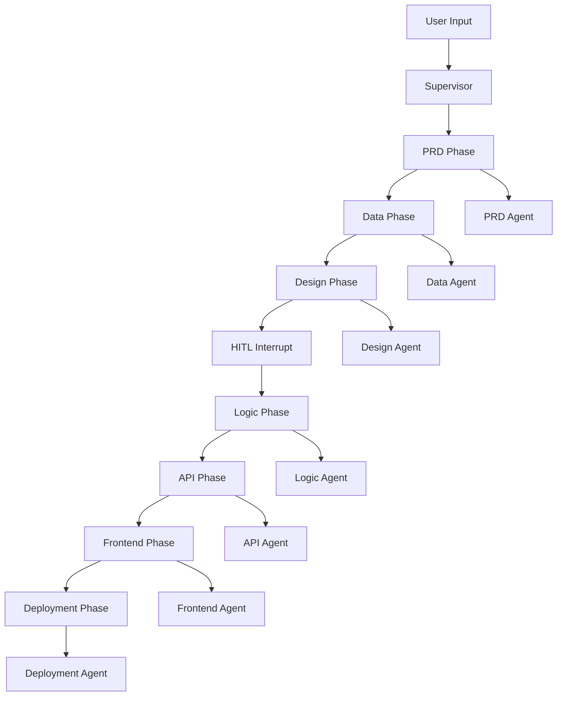

Parti Architecture uses a multi-agent orchestration system with sequential and parallel execution phases, human-in-the-loop interrupts, and artifact generation.

## System Overview



## Execution Phases

### Sequential Phases

Most phases execute sequentially:

1. **PRD** → Product Requirements Document
2. **Data** → Data models and schemas
3. **Design** → Design system and tokens
4. **Logic** → Business logic and workflows
5. **API** → API specification
6. **Frontend** → Frontend architecture
7. **Deployment** → Infrastructure and CI/CD

### Parallel Execution

Some phases support parallel execution (fan-out/fan-in):

- **PRD, Data, Logic** - Can execute in parallel
- Results merged after completion
- Used for independent artifact generation

## Human-in-the-Loop (HITL)

Strategic interrupt points for human review:

### Interrupt Triggers

- **After Logic Phase**: Review business rules before API design
- **After API Phase**: Review API spec before frontend implementation
- **Manual Interrupts**: User-initiated pauses

### Interrupt Flow

1. Agent sets `interrupt_signal: true`
2. Supervisor pauses execution
3. Human reviews artifacts
4. Human approves or requests changes
5. Execution resumes or restarts

## State Management

### Architecture State

```typescript
interface ArchitectureState {
  project_id: string;
  current_phase: string;
  status: 'active' | 'interrupted' | 'complete' | 'error';
  artifacts: Record<string, any>;
  system_state: {
    current_phase: string;
    interrupt_signal?: boolean;
  };
}
```

### State Transitions

```
PRD → Data → Design → [HITL] → Logic → API → [HITL] → Frontend → Deployment
```

## Artifact Generation

### Artifact Types

- **Markdown**: PRDs, specifications, documentation
- **Code**: Schemas, configurations, scripts
- **JSON**: Structured data, configurations

### Artifact Storage

- **Small artifacts**: D1 database (text storage)
- **Large artifacts**: R2 storage (object storage)
- **Versioning**: Timestamp-based versioning

## Graph Execution

The supervisor uses graph-based execution:

### Parallel Nodes

```typescript
async function executeParallelNodes(state, env) {
  // Fan-out: Execute multiple agents
  const promises = agents.map(agent => agent.fetch(request));
  const results = await Promise.all(promises);
  
  // Fan-in: Merge results
  return mergeResults(state, results);
}
```

### Sequential Nodes

```typescript
async function executeSequentialNodes(state, env) {
  for (const agent of agents) {
    state = await executeAgent(agent, state);
    if (requiresInterrupt(state)) break;
  }
  return state;
}
```

## Streaming Architecture

Real-time progress via Server-Sent Events:

### Event Types

- `agent_start` - Agent execution started
- `agent_progress` - Progress update
- `agent_complete` - Agent execution completed
- `phase_complete` - Phase completed
- `interrupt` - HITL interrupt triggered

### Stream Flow

```
Client → Supervisor → Agents → Supervisor → Client (SSE)
```

## Error Handling

### Agent Errors

- Agent failures don't block entire pipeline
- Errors logged in execution traces
- Supervisor can retry or skip failed agents

### State Recovery

- Checkpoints stored at interrupt points
- State can be restored from checkpoints
- Project state persisted in D1

## Related Documentation

- [Backend Supervisor](/parti-architecture/backend/supervisor) - Implementation
- [Backend Agents](/parti-architecture/backend/agents) - Agent details
- [Supervisor API](/parti-architecture/api/supervisor) - API reference

