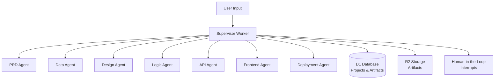

Parti Architecture is a multi-agent system that orchestrates specialized AI agents to generate complete software architecture specifications, from product requirements to deployment configurations.

## Architecture



## Key Features

<CardGroup cols={2}>
  <Card title="Multi-Agent System" icon="network">
    7 specialized agents orchestrated by supervisor
  </Card>
  <Card title="Sequential Pipeline" icon="workflow">
    PRD → Data → Design → Logic → API → Frontend → Deployment
  </Card>
  <Card title="Human-in-the-Loop" icon="user-check">
    Strategic interrupt points for review and approval
  </Card>
  <Card title="Artifact Generation" icon="file-code">
    Complete specifications and code artifacts
  </Card>
  <Card title="Graph Execution" icon="diagram-project">
    Parallel and sequential agent execution
  </Card>
  <Card title="Streaming Responses" icon="stream">
    Real-time progress updates via SSE
  </Card>
</CardGroup>

## Agent System

The system consists of 7 specialized agents plus a supervisor:

1. **PRD Agent** - Product Requirements Document generation
2. **Data Agent** - Data modeling and schema design
3. **Design Agent** - UI/UX design system and tokens
4. **Logic Agent** - Business logic and workflows
5. **API Agent** - REST/GraphQL API specifications
6. **Frontend Agent** - React component architecture
7. **Deployment Agent** - Infrastructure and CI/CD pipelines

## Execution Phases

The system executes through sequential phases:

1. **PRD** - Product requirements and user stories
2. **Data** - Entity models and relationships
3. **Design** - Design system and UI tokens
4. **Logic** - Business rules and workflows
5. **API** - API endpoints and schemas
6. **Frontend** - Component hierarchy and state management
7. **Deployment** - Infrastructure and deployment configs

## Human-in-the-Loop (HITL)

Strategic interrupt points allow human review:

- **After PRD** - Review requirements before data modeling
- **After Logic** - Review business rules before API design
- **After API** - Review API spec before frontend implementation

## Quick Start

### Prerequisites

- **Bun** (recommended) or Node.js
- **Cloudflare Account** with Workers access
- **Gemini API Key** (for agent execution)

### Installation

```bash
cd parit-architecture
bun install
```

### Environment Setup

Create `.env.local`:

```bash
VITE_GEMINI_API_KEY=your-gemini-key
```

### Development

```bash
# Start frontend
bun run dev

# Deploy all workers
bun run deploy:all
```

## Project Structure

```
parit-architecture/
├── workers/
│   ├── supervisor/      # Orchestration worker
│   ├── prd-agent/       # PRD generation
│   ├── data-agent/      # Data modeling
│   ├── design-agent/    # Design system
│   ├── logic-agent/     # Business logic
│   ├── api-agent/       # API specification
│   ├── frontend-agent/  # Frontend architecture
│   └── deployment-agent/ # Infrastructure
├── src/                 # Frontend React app
├── packages/
│   └── shared/          # Shared types and utilities
└── docs/                # Documentation
```

## Related Documentation

- [Supervisor API](/parti-architecture/api/supervisor) - Supervisor worker API
- [Agent API](/parti-architecture/api/agents) - Agent workers API
- [Frontend Canvas](/parti-architecture/frontend/canvas) - Agent canvas interface
- [Backend Supervisor](/parti-architecture/backend/supervisor) - Supervisor implementation
- [Backend Agents](/parti-architecture/backend/agents) - Agent implementations
- [Design Architecture](/parti-architecture/design/architecture) - System architecture

